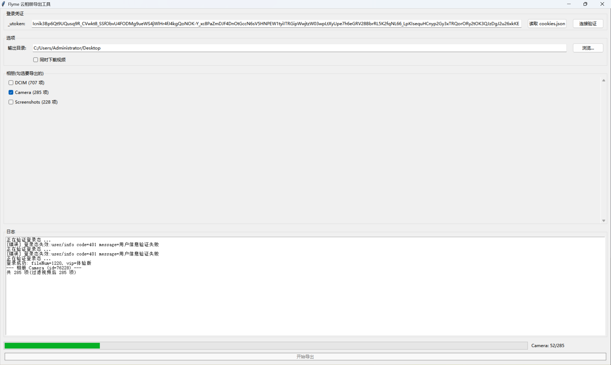

# Flyme Photo Exporter

备份本人魅族 Flyme 云相册（https://photos.flyme.cn）的工具，**下载原图**（非缩略图）与视频。

> **提供三种使用方式**：
> - **Windows 可执行文件**：`dist/flyme-photo-exporter.exe`（免安装，双击即用）
> - **图形界面版**：`scripts/flyme_export_gui.py`（Python + Tkinter，选相册、看进度、点按钮导出）
> - **命令行版**：`scripts/flyme_export.js`（Node.js + Playwright）

> **合规声明**：本工具仅供个人备份**本人账号**内的相册内容，不内置任何账号共享、群控、撞库能力。使用本工具需自行承担违反 Flyme 用户协议或触发风控封号的风险。请勿用于他人账号或商业用途。

## 这是什么

一个把魅族云相册**备份到本地**的工具：

- 你在 Chrome 登录 photos.flyme.cn（含滑块/二次验证）
- 把登录凭证（`_utoken` 或 cookie）交给本工具
- 工具解密 OSS 临时凭证，按阿里云 OSS 签名算法生成原图下载 URL，把图片/视频写到本地 `./photos/`

## 技术方案

魅族云相册图片存阿里云 OSS 私有桶，需要 STS 临时凭证 + SigV1 签名。核心思路：

1. **解密 STS 凭证**：flyme 前端 SDK 会把 `file/get_sig/v2` 返回的加密 STS 凭证用内置 RSA 私钥解密。工具复用该私钥，解密得到 `{bucket, region, accessKeyId, accessKeySecret, securityToken}`。
2. **计算签名下载**：按阿里云 OSS SigV1 算法（HMAC-SHA1），对每张照片的原图 object key（`photo.url` 字段）计算签名 URL，然后下载原图。

这样**完全绕开 sign 破解与 STS 解析**，且下载的是**原图**（`image/jpeg`，`photo.size` 字节数完全一致），而非缩略图。

> **两个版本的技术差异**：
> - **命令行版**（Node.js）：用 Playwright 打开网页、复用浏览器里的 `JSEncrypt` 解密 STS，需要 Node.js + Chromium。
> - **图形界面版 / exe**（Python）：直接用 `requests` 调接口 + `cryptography` 解密 STS + `hmac` 签名，**无需浏览器、无需 Node.js**，最轻量。

## 功能

- ✅ 解密 STS 凭证，计算签名 URL，下载**原图** JPEG + MP4 视频
- ✅ 断点续传：同名文件 + size 一致自动跳过
- ✅ STS 凭证过期自动刷新（`expiredTime` 前 5 分钟触发）
- ✅ 按相册分文件夹，文件名保持原样
- ✅ 图形界面 / 命令行双版本，界面版支持勾选相册、实时进度
- ✅ 单文件重试 3 次，指数退避
- ✅ 并发下载，默认 5 线程
- ✅ 视频支持：默认跳过，可开启下载照片 + 视频

## 方式一：Windows 可执行文件（推荐，免安装）

下载 `dist/flyme-photo-exporter.exe`，**双击运行**即可，无需安装 Python 或任何依赖。



操作流程：

1. 在输入框粘贴 `_utoken`（或把 `cookies.json` 放在 exe 同目录，点「读取 cookies.json」自动读取）
2. 点「连接验证」，界面会列出所有相册
3. 勾选要导出的相册，选择是否「同时下载视频」
4. 点「开始导出」，进度条和日志实时显示

> 首次运行 Windows 可能弹出 SmartScreen 提示，点「更多信息 → 仍要运行」即可（因为是未签名的个人程序）。

## 方式二：图形界面版（Python 源码运行）

```bash
# 安装依赖（Tkinter 是 Python 自带，无需装）
pip install requests cryptography

# 启动图形界面
python scripts/flyme_export_gui.py
```

操作流程与 exe 版相同。

## 方式三：命令行版（Node.js）

```bash
cd flyme-photo-exporter
npm install
npx playwright install chromium   # 若 npm install 未自动装浏览器
```

### 系统要求（仅命令行版需要）

- Windows 10/11 x64 / macOS / Linux
- **Node.js 18+**（依赖全局 `fetch`、`crypto` 模块）
- ~150 MB 磁盘：Playwright chromium 二进制

> 无论哪个版本，都需要网络能访问 `photos.flyme.cn`、`mzstorage.meizu.com`、`meizu-storage.oss-cn-shanghai.aliyuncs.com`。

## 命令行版使用说明

### 1. 导出 cookie

在已登录 photos.flyme.cn 的 Chrome 里，导出当前域名 + `.flyme.cn` + `.meizu.com` 的**全部** cookie。

**方式 A：F12 → Application → Cookies**

依次选中 `https://photos.flyme.cn`、`.flyme.cn`、`.meizu.com`、`login.flyme.cn` 各域，把 cookie 手敲成 `--cookie "name1=value1; name2=value2; ..."`。

**方式 B：JSON 文件（推荐）**

用 `EditThisCookie` / `Cookie Editor` 扩展导出 JSON，保存为 `cookies.json`：

```json
[
  { "name": "_utoken", "value": "xxx...", "domain": ".flyme.cn", "path": "/" },
  { "name": "DSESSIONID", "value": "xxx...", "domain": ".flyme.cn", "path": "/", "httpOnly": true },
  ...
]
```

**关键 cookie**：

| cookie 名 | 用途 |
| --- | --- |
| `_utoken` | 主要鉴权 token（**必须**，短期有效，几小时到一天） |
| `DSESSIONID` | 会话（`.flyme.cn` 与 `.meizu.com` 都要） |
| `JSESSIONID` | login.flyme.cn 会话 |

> 提示：`_utoken` 有效期较短（约 8 小时）。如果中途报登录态失败，重新登录后重新导出即可，已下载的文件会自动跳过（断点续传）。

### 2. 试运行（最快验证）

```bash
# 单相册 + 仅 1 页（~34 张原图）验证流程
node scripts/flyme_export.js --cookie-file cookies.json --album 76227 --limit 1
```

成功的话 `./photos/Screenshots/` 下会有几十张 **JPEG 原图**（每张几百 KB 到几 MB，不是几十 KB 的缩略图）。

### 3. 完整导出

```bash
# 全部相册（DCIM + Camera + Screenshots）
node scripts/flyme_export.js --cookie-file cookies.json

# 仅 Screenshots 相册（dirId=76227），配合断点续传可重复执行
node scripts/flyme_export.js --cookie-file cookies.json --album 76227

# 自定义输出路径 + 并发数
node scripts/flyme_export.js --cookie-file cookies.json --out D:\backup\flyme --concurrency 5

# 同时下载视频（照片 + 视频）
node scripts/flyme_export.js --cookie-file cookies.json --video
```

### 4. 续传

如果中途中断（token 过期 / 网络抖动）：

1. 重新登录
2. 重新导出 cookie
3. 重跑同一条命令，已存在且 size 一致的文件自动跳过

## CLI 参数

| 参数 | 说明 | 默认 |
| --- | --- | --- |
| `--cookie "..."` | 直接传 cookie 字符串 | - |
| `--cookie-file path` | 从 JSON 文件读 cookie | - |
| `--album dirId` | 仅导一个相册（推荐用于大相册分批） | 全部 |
| `--out dir` | 输出目录 | `./photos` |
| `--limit pages` | 每相册前 N 页（快速测试用） | 全部 |
| `--concurrency n` | 并发下载数 | 5 |
| `--retry n` | 单文件重试次数 | 3 |
| `--video` | 同时下载视频（`isVideo=true`），默认跳过 | 关闭 |
| `--headless false` | 有头模式（调试用，能看到浏览器窗口） | headless |

## 目录结构

```
flyme-photo-exporter/
├── dist/
│   └── flyme-photo-exporter.exe   # Windows 可执行文件(免安装)
├── scripts/
│   ├── flyme_export_gui.py       # 图形界面版(Python + Tkinter)
│   ├── flyme_export.js           # 命令行版(Node.js)
│   └── capture_guide.py          # 抓包辅助脚本
├── docs/                         # 使用指南 / 实现方案 / 复盘 / 协议文档
├── app/                          # 旧 Phase 1 Python 骨架(已废弃,保留参考)
├── main.py                       # 旧 PyQt6 GUI 入口(已废弃,保留参考)
├── package.json                  # 命令行版依赖
├── requirements.txt              # 图形界面版依赖(requests + cryptography)
└── README.md                     # 本文件
```

输出目录示例（相册目录名 = `dirName`）：

```
photos/
├── DCIM/            # 707 项(636 照片 + 71 视频)
│   ├── IMG_20200101_120000.jpg
│   └── V00730-182650.mp4
├── Camera/          # 285 张
└── Screenshots/     # 228 张
```

## 安全与风险

- ⚠️ **仅限本人账号**：你承担一切使用风险
- ⚠️ **token 安全**：cookie 字符串包含登录态，不要提交到 git（已加入 `.gitignore`）
- ⚠️ **频率限制**：建议并发 ≤ 5，过高可能触发 flyme 风控
- ⚠️ **视频体积**：视频单个可达 100MB+，加 `--video` 会额外占用磁盘空间

## 常见问题

**Q: 报错 `登录态验证失败`？**
A: cookie 已过期（`_utoken` 有效期较短）。重新登录后重新导出。

**Q: 报错 `导航后跳到 login.flyme.cn`？**
A: cookie 已过期或被浏览器清掉。重新登录 photos.flyme.cn，刷新页面后立刻复制 cookie。

**Q: 下载的是原图还是缩略图？**
A: 原图。文件 magic bytes 为 `FF D8 FF`（JPEG），大小与相册元数据 `photo.size` 完全一致。缩略图是 `@256w_2o.webp`，本工具不会下载。

**Q: 视频怎么下载？**
A: 界面版勾选「同时下载视频」；命令行版加 `--video` 参数。默认跳过是为了避免误下大文件。

**Q: exe 双击没反应 / 被拦截？**
A: Windows SmartScreen 可能拦截未签名程序，点「更多信息 → 仍要运行」。若双击闪退，把 `cookies.json` 放 exe 同目录再试，或改用 `python scripts/flyme_export_gui.py` 源码运行查看报错。

**Q: 图形界面版和命令行版用哪个？**
A: 普通用户用 **exe 或 GUI 版**（免装环境）；需要自动化/脚本化时才用命令行版。

**Q: 旧 Python 代码（app/、main.py）还能用吗？**
A: 旧 `app/`、`main.py`、`build.spec` 是 Phase 1 的 PyQt6 骨架，已废弃，仅作协议逆向参考保留。当前可用的入口是 `scripts/flyme_export_gui.py`（GUI）和 `scripts/flyme_export.js`（CLI）。

## License

MIT
